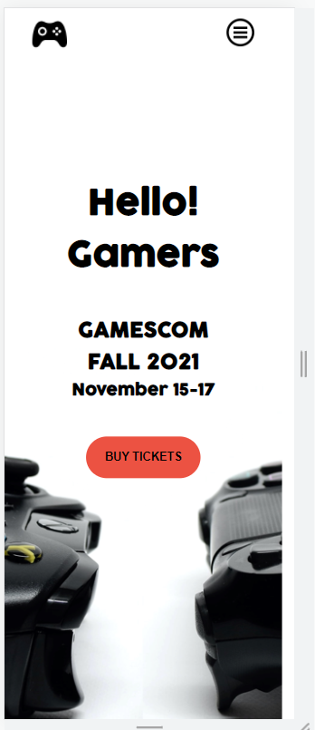

# GAMESCOM Event

>Projects Screenshots

### Mobile Page

### Hamburger Menu

### About Pge

## Built With

- HTML
- CSS (using Flex and Grid)
- JS

## Live Demo

[Live Demo Link](https://kakarrot92.github.io/FirstCapstostone/)

## Getting Started
Open your command line 
**To clone this project, in your command line move where your want to save the project** 
**Run this command `git clone https://github.com/kakarrot92/FirstCapstostone.git`**
**Move into the project ` cd FirstCapstostone`**
**or press the green Code button in the upper right corner and choose to download from the Download ZIP link.**

### Prerequisites

- Code editor (VS Code, Sublime, Atom)

## Authors

👤 **Bogdan Stojanovic**

- GitHub:https://github.com/kakarrot92
- Twitter:https://twitter.com/kakarrot1992
- LinkedIn:https://www.linkedin.com/in/bogdan-stojanovic-97829b136/

## Acknowledgments
- Inspired by original design for Creative Commons by Cindy Shin on [Behance](https://www.behance.net/gallery/29845175/CC-Global-Summit-2015)

## Show your support

Give a ⭐️ if you like this project!

## 📝 License

This project is [MIT](./MIT.md) licensed.

